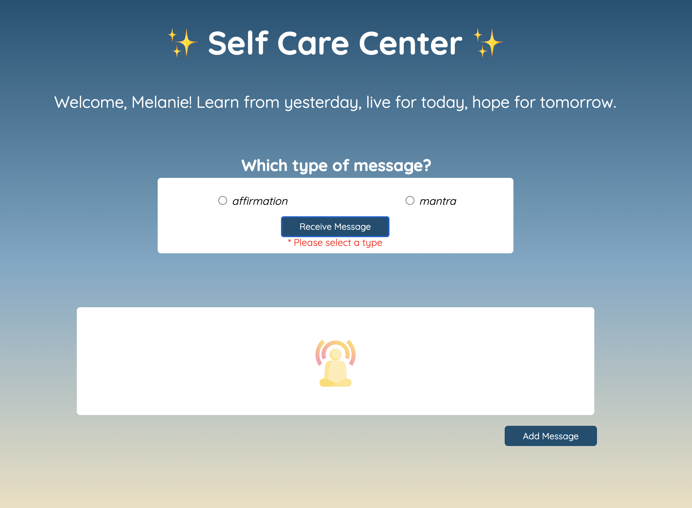

# Self Care Center
Need a boost in your day? Launch the Self Care Center to receive a positive message.

## Description

“Affirmations are thoughts of positive self-empowerment, meant to assert your self-worth. Mantras are repetitive phrases that are repeated again and again during mindfulness practices.  

- To log into the Self Care Center, enter in a name and click submit.
- Select either the affirmation or mantra button to receive a message.

- Continue to click the receive message button to shuffle through more messages. 
- Users have the option to add their own messages. To submit an add message form, select a message type and enter a message.

- The clear button will reset the message box

## Setup
- [Click here for GitHub Pages](https://daomeow.github.io/self-care-center/.)
- Fork this project to your own Github account
- Clone the repository to your local machine
- `cd` into the project
- `open index.html` to open Self Care Center 
- [Click here for GitHub Pages](https://daomeow.github.io/self-care-center/.)

## Authors

Melanie Daoheuang [@daomeow](https://github.com/daomeow)

## Extensions
- Login Page
- User can add their own message
- Error handling and clear button
